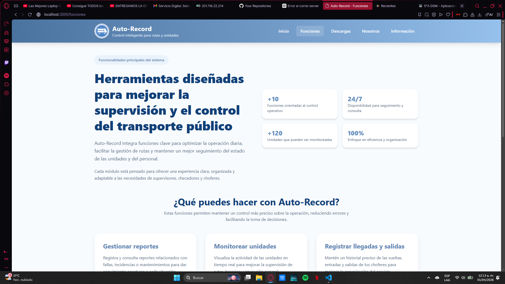
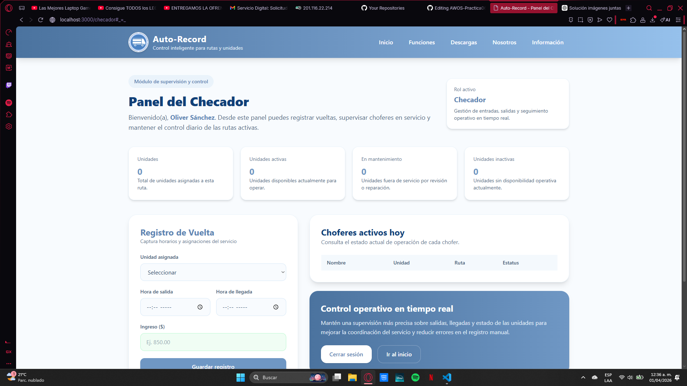
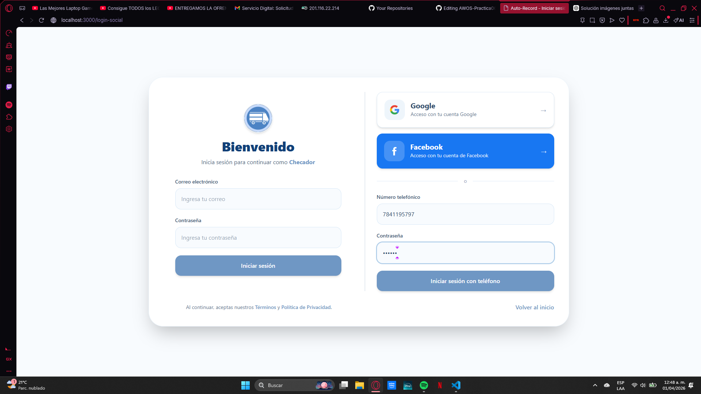
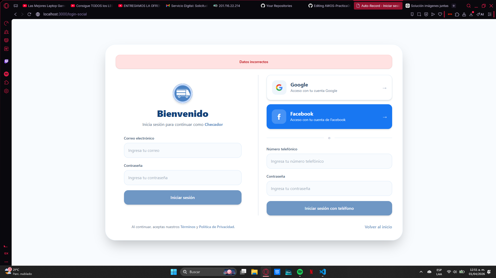
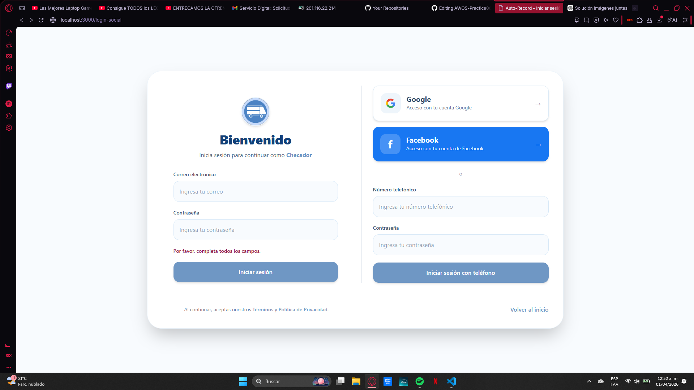
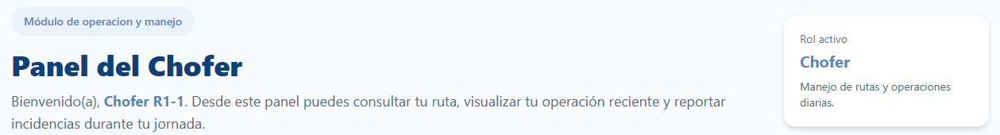
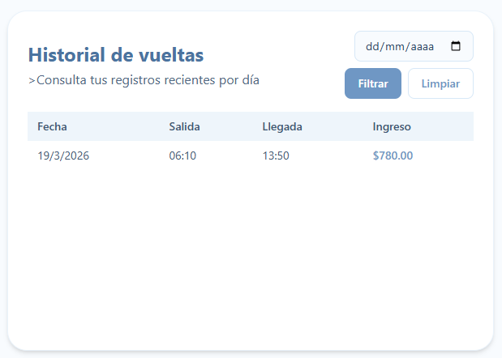
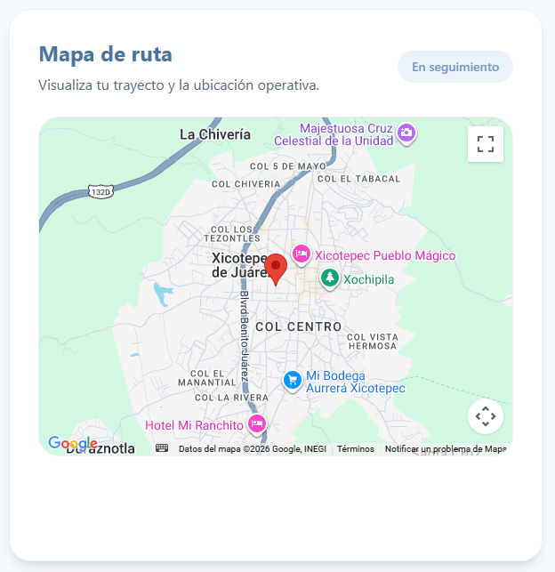
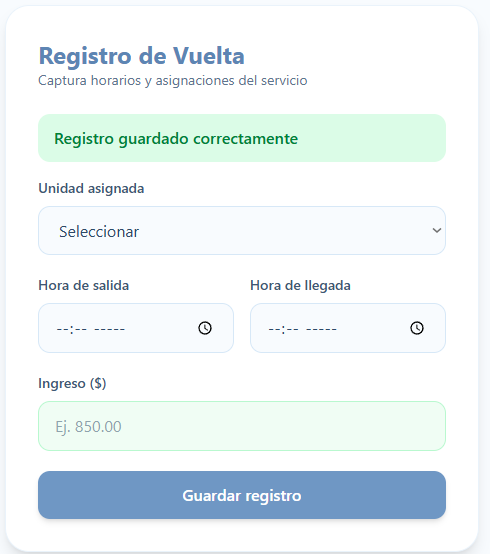
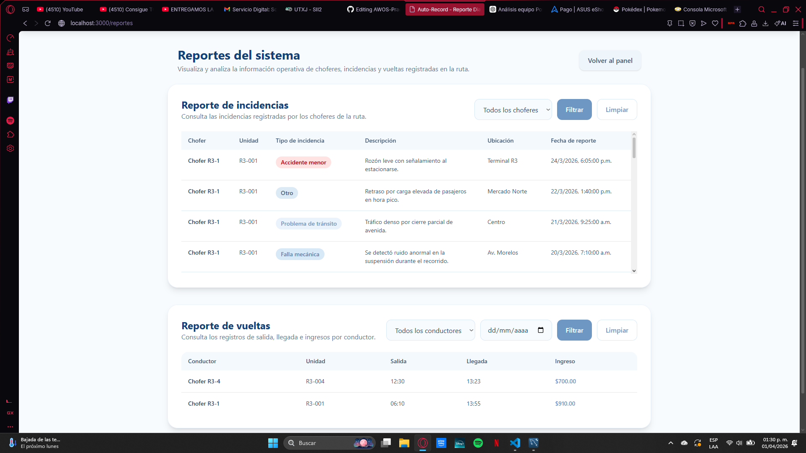

# Proyecto Auto-Récord

## Identidad Gráfica 

La identidad visual de Auto-Record está diseñada para transmitir control, confianza y profesionalismo, valores clave en un sistema enfocado a la administración y monitoreo de flotillas vehiculares.

---

## Descripción General 

**Auto-Record** es una aplicación web diseñada para optimizar la administración, el monitoreo y el control operativo de flotillas de transporte, especialmente en contextos donde la organizacióny la eficiencia son fundamentales. El sistema surge como una solución tecnológica orientada a centralizar la información clave de las unidades, los viajes y los responsables de operación, reduciendo el uso de registros manuales y minimizando errores en la gestión diaria.

La plataforma permite llevar un control preciso de los horarios de inicio y fin de viaje, el estado de las unidades (activas, inactivas o en mantenimiento) y el registro de incidencias o fallas reportadas por el administrador (checador). Auto-Record está pensado para distintos roles de usuario, como dueños, administradores y checadores ofreciendo interfaces específicas según sus funciones, lo que garantiza un uso más eficiente y seguro de la información.

Desde el punto de vista tecnológico, Auto-Record prioriza la integridad de los datos y la claridad en la visualización de la información mediante reportes y métricas que apoyan la toma de decisiones. Su diseño busca una experiencia de usuario intuitiva, con flujos simples y una identidad visual sobria que transmite confianza y profesionalismo.

Además, el sistema contribuye a una mejor planificación operativa y financiera, al permitir el análisis histórico de viajes, fallas y rendimiento de las unidades. En conjunto, Auto-Record se posiciona como una herramienta integral que fortalece la gestión del transporte, mejora la comunicación entre los departamentos involucrados y promueve un control más transparente y eficiente de las operaciones diarias.

---

## Objetivo General 

Desarrollar una aplicación web que permita la administración, monitoreo y control eficiente de una flotilla de combis, facilitando la gestión de unidades, choferes, horarios, fallas y estados operativos, beneficiando tanto al dueño como al personal operativo.

---

## Objetivos Específicos 

1. Monitorear el estado de las unidades (activas, inactivas, en mantenimiento).
2. Permitir el registro y seguimiento de fallas reportadas.
3. Mejorar el control operativo del dueño de la flotilla.
4. Reducir errores en registros manuales.
5. Registrar el inicio y fin de jornada de cada unidad.

--- 

## Tabla de Fases

| Nº    | Actividad del Proyecto             | Descripción                                                                               | Estatus         |
| ----- | ---------------------------------- | ----------------------------------------------------------------------------------------- | --------------- |
| **1** | Configuración inicial del proyecto | Instalación y estructura base del servidor usando **Node.js y Express**                   | ✅ Completado    |
| **2** | Creación de interfaz base          | Desarrollo del **index principal y estilos CSS** del sistema                              | ✅ Completado    |
| **3** | Configuración de APIs              | Integración de **Google Maps API y autenticación social (Google / Facebook)**             | ✅ Completado    |
| **4** | Implementación de base de datos    | Integración de una **base de datos para almacenamiento de usuarios, rutas e incidencias** | ✅ Completado    |
| **5** | Documentación                      | Elaboración de la **documentación técnica y de uso del sistema**                          | ✅ Completado |

---

## Evidencias del proyecto

### Prueba01: Navegacion
Se comprueba que toda la navegacion basica funcione correctamente

Vista del módulo Inicial

  

<figcaption>Vista del módulo Funciones</figcaption>
  

<figcaption>Vista del módulo Descargas</figcaption>
  

<figcaption>Vista del módulo Nosotros</figcaption>
  

<figcaption>Vista del módulo Informacion</figcaption>
  

### Prueba02: Descarga
En el codigo que dio funcion al boton de descargar, de momento el archivo adjuntado para la descarga es una prueba

<figcaption>En el apartado superior se visualiza la correcta funcion el boton</figcaption>
  

### Prueba03: Funcion de las Apis de Login
Se usuaron apis de login de google y facebook

<figcaption>Modulo de login</figcaption>
  

#### Goggle

<figcaption>Logeo con Goggle</figcaption>
 

<figcaption>Logeo con Goggle(Resultado)</figcaption>
  

#### Facebook

<figcaption>Logeo con Facebook</figcaption>
 

<figcaption>Logeo con Facebook(Resultado)</figcaption>
  

### Prueba04: Logeo con usuarios en la BD
Se conecto el codigo a la BD para tener tener una mejor gestion de usuarios

<figcaption>Logeo con correo</figcaption>
  

<figcaption>Logeo con numero telefonico</figcaption>
  

<figcaption>Resultado</figcaption>
  

### Prueba05: Error en logeo
El logeo funciona dando una "ID" para identificar el rol del usuario a logear si es Checador en la BD tiene que coincidir los datos, en caso de no funcionar dan error

<figcaption>Error: Datos incompletos</figcaption>
  

<figcaption>Error: Datos Erroneos</figcaption>
  

### Prueba06: Conexcion de la BD a los datos del Usuario
Los datos del usuario que estan Guardados en la BD se usan para el codigo, 

<figcaption>Datos del Checador, se muestra datos de su ruta asignada</figcaption>
  

<figcaption>En el panel del conductor solo muestra datos como nombre y rol</figcaption>
  

#### Tablas de los roles

<figcaption>Tabla de conductores activos</figcaption>
  

<figcaption>Tabla de vueltas realizadas del conductor</figcaption>
  

### Prueba07: Api de Mapas

<figcaption>Api de Mapas cargado correctamente</figcaption>
  

### Prueba08: Subir reportes a la BD

#### Conductor

<figcaption>Introduccion de Datos para el reporte</figcaption>
  

<figcaption>Se subio el Reporte correctamente</figcaption>
  

<figcaption>Vista desde la BD</figcaption>
  

#### Operador

<figcaption>Introduccion de Datos para el registro de vueltas</figcaption>
  

<figcaption>Se subio el Registo correctamente</figcaption>
  

<figcaption>Vista desde la BD</figcaption>
  

### Prueba09: Correcta carga de las Tablas

<figcaption>Correcta visualizacion de los Reportes/Registros</figcaption>
  

### Prueba10: Correcta carga de los filtros

<figcaption>Correcta visualizacion de los filtros</figcaption>
  
