## Evidencias del proyecto

### Prueba01: Navegacion
Se comprueba que toda la navegacion basica funcione correctamente

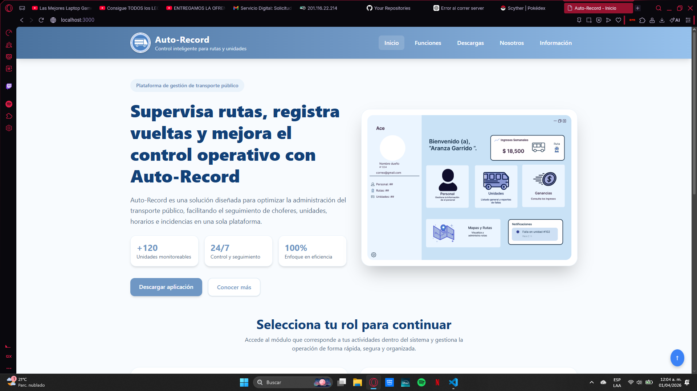

Vista del módulo Inicial

  

Vista del módulo Funciones

  

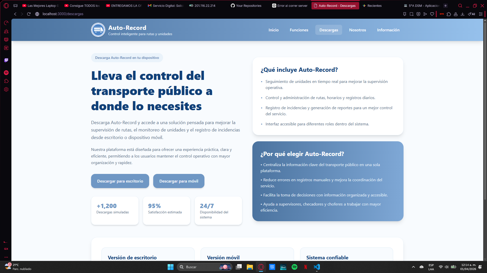

Vista del módulo Descargas

  

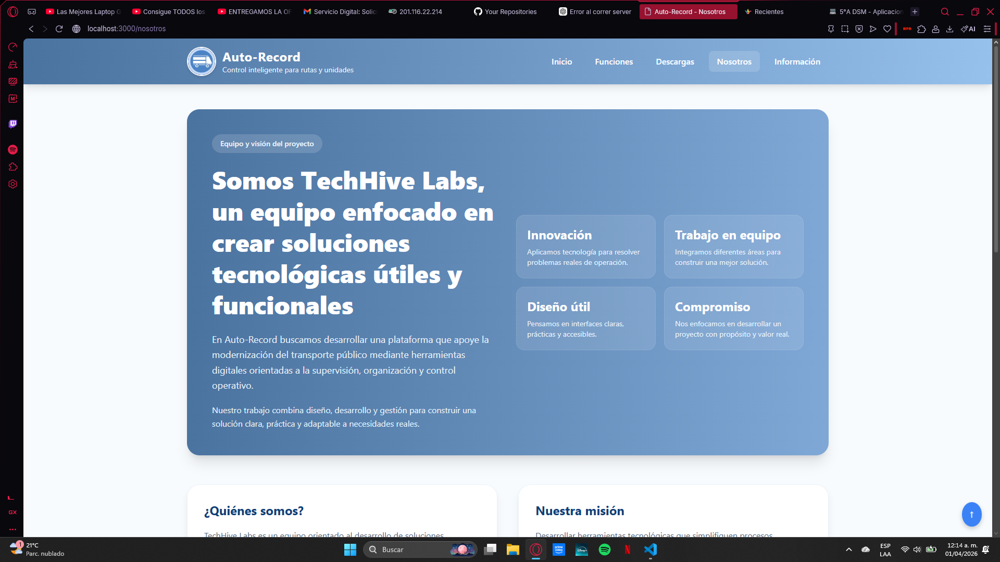

Vista del módulo Nosotros

  

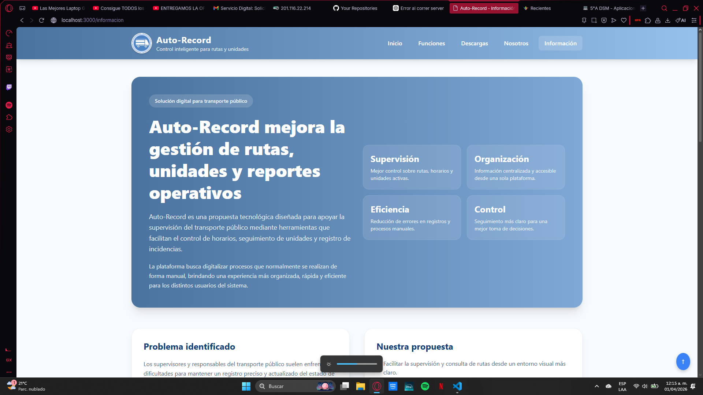

Vista del módulo Informacion

  

### Prueba02: Descarga
En el codigo que dio funcion al boton de descargar, de momento el archivo adjuntado para la descarga es una prueba

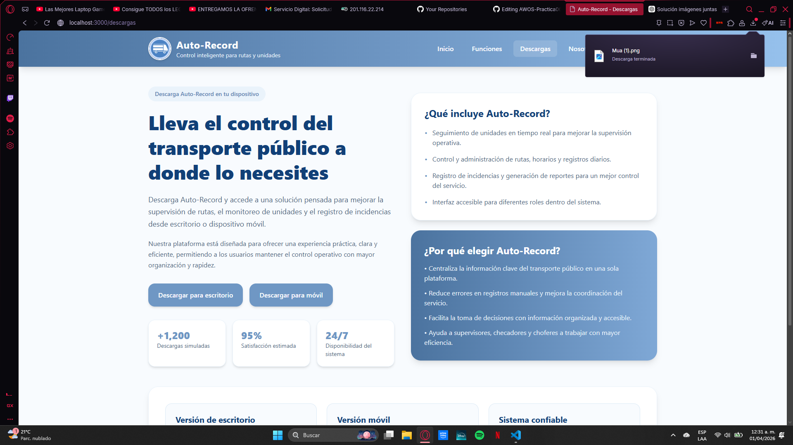

En el apartado superior se visualiza la correcta funcion el boton

  

### Prueba03: Funcion de las Apis de Login
Se usuaron apis de login de google y facebook

Modulo de login

  

#### Goggle
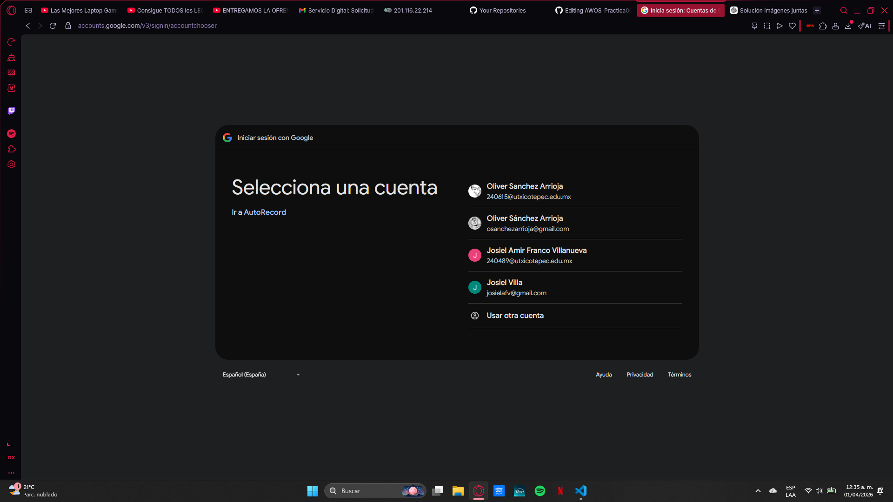

Logeo con Goggle

 

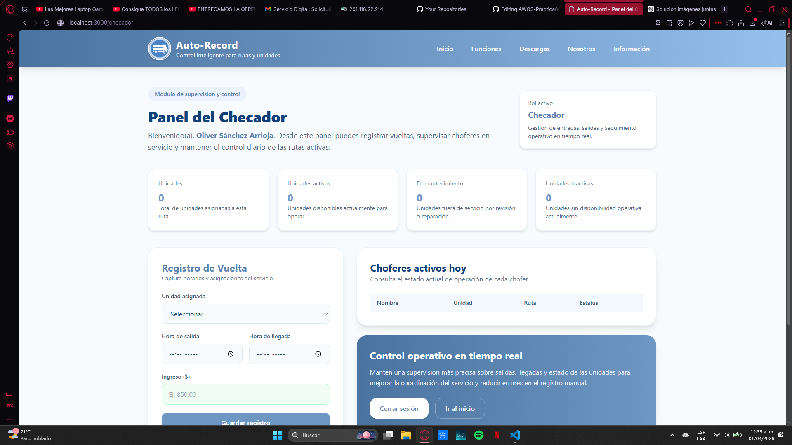

Logeo con Goggle(Resultado)

  

#### Facebook
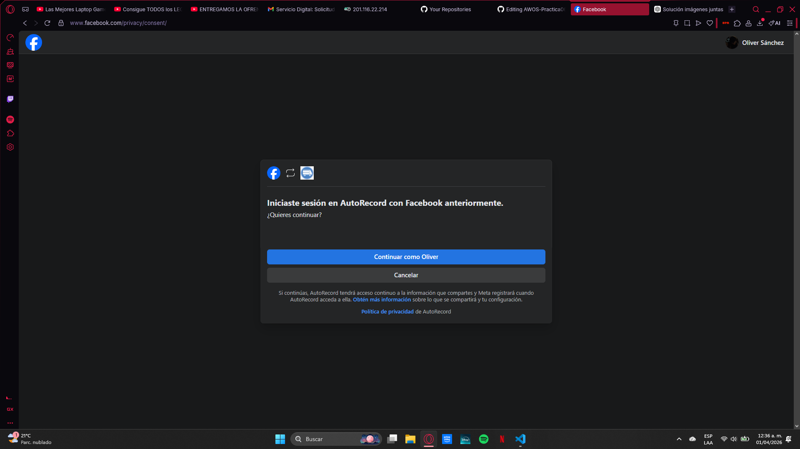

Logeo con Facebook

 

Logeo con Facebook(Resultado)

  

### Prueba04: Logeo con usuarios en la BD
Se conecto el codigo a la BD para tener tener una mejor gestion de usuarios

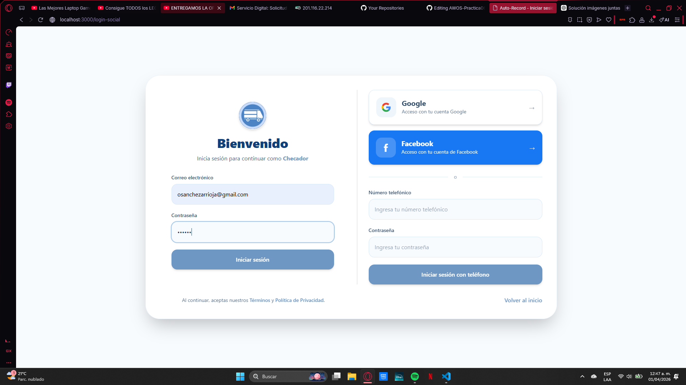

Logeo con correo

  

Logeo con numero telefonico

  

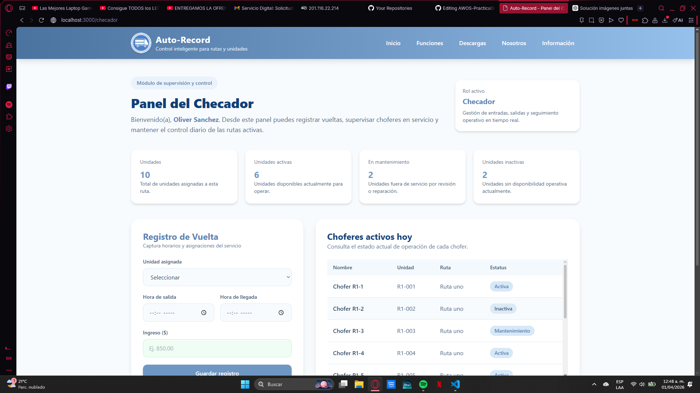

Resultado

  

### Prueba05: Error en logeo
El logeo funciona dando una "ID" para identificar el rol del usuario a logear si es Checador en la BD tiene que coincidir los datos, en caso de no funcionar dan error

Error: Datos incompletos

  

Error: Datos Erroneos

  

### Prueba06: Conexcion de la BD a los datos del Usuario
Los datos del usuario que estan Guardados en la BD se usan para el codigo, 

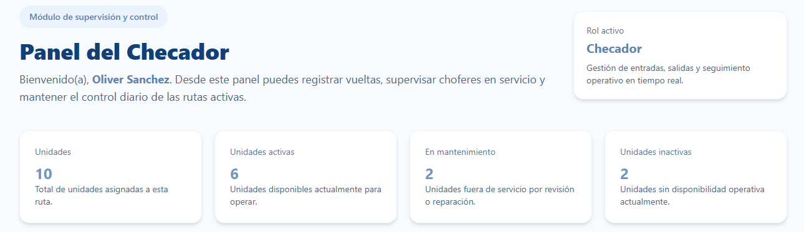

Datos del Checador, se muestra datos de su ruta asignada

  

En el panel del conductor solo muestra datos como nombre y rol

  

#### Tablas de los roles

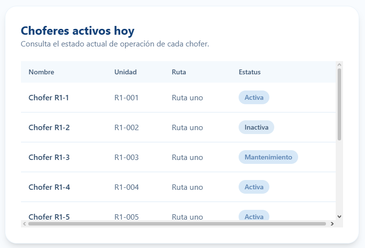

Tabla de conductores activos

  

Tabla de vueltas realizadas del conductor

  

### Prueba07: Api de Mapas

Api de Mapas cargado correctamente

  

### Prueba08: Subir reportes a la BD

#### Conductor
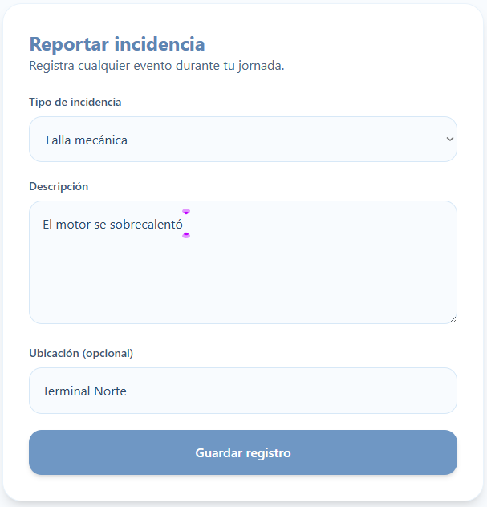

Introduccion de Datos para el reporte

  

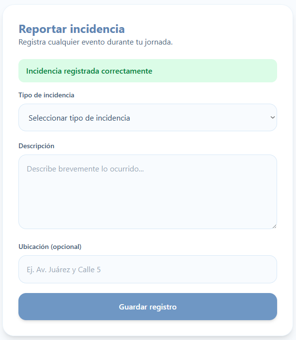

Se subio el Reporte correctamente

  

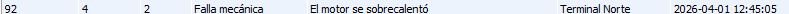

Vista desde la BD

  

#### Operador
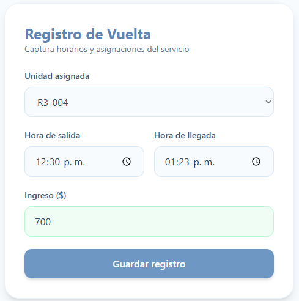

Introduccion de Datos para el registro de vueltas

  

Se subio el Registo correctamente

  

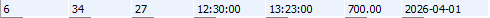

Vista desde la BD

  

### Prueba09: Correcta carga de las Tablas

Correcta visualizacion de los Reportes/Registros

  

### Prueba10: Correcta carga de los filtros

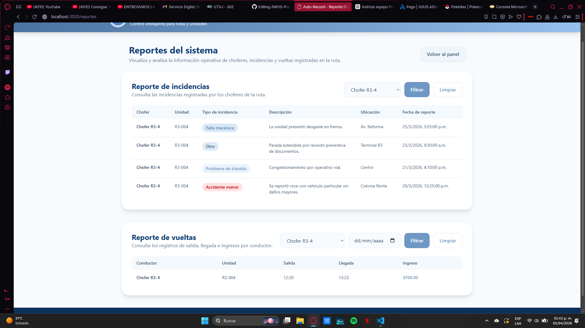

Correcta visualizacion de los filtros

  
