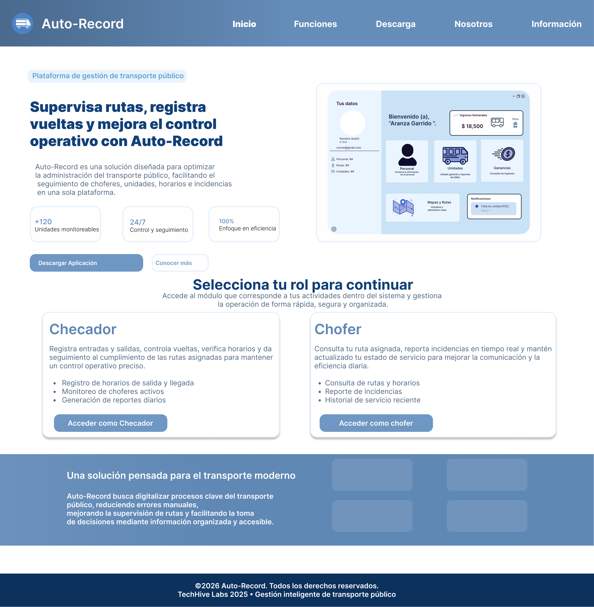
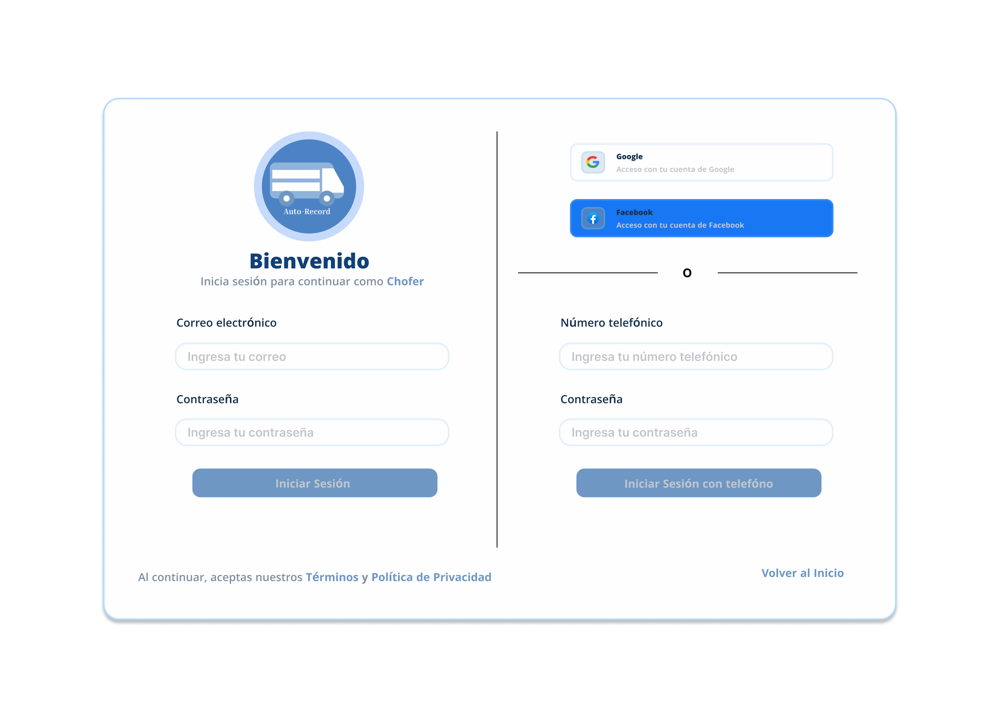
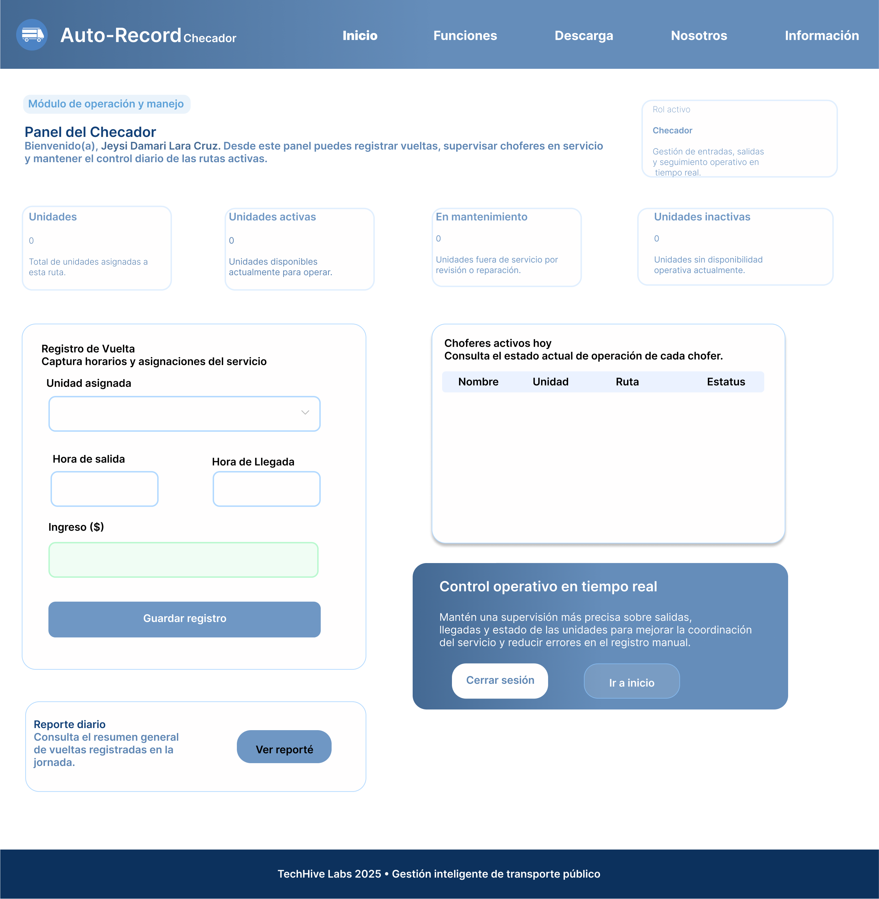
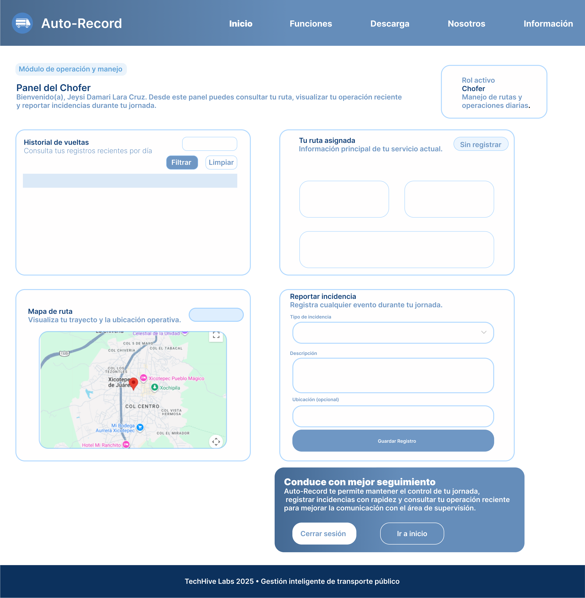
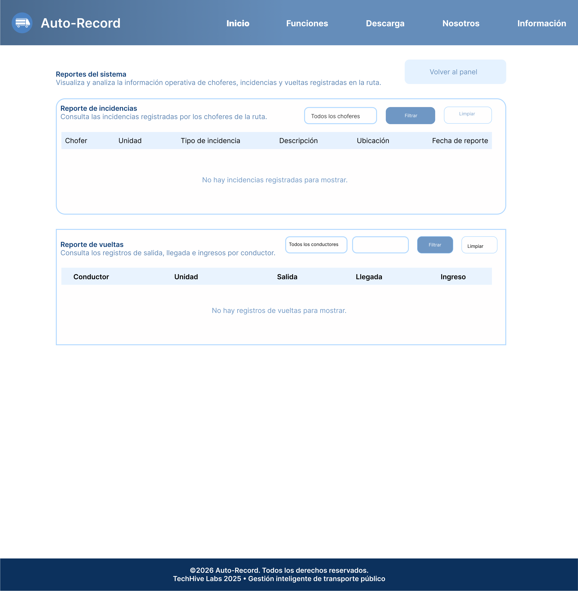
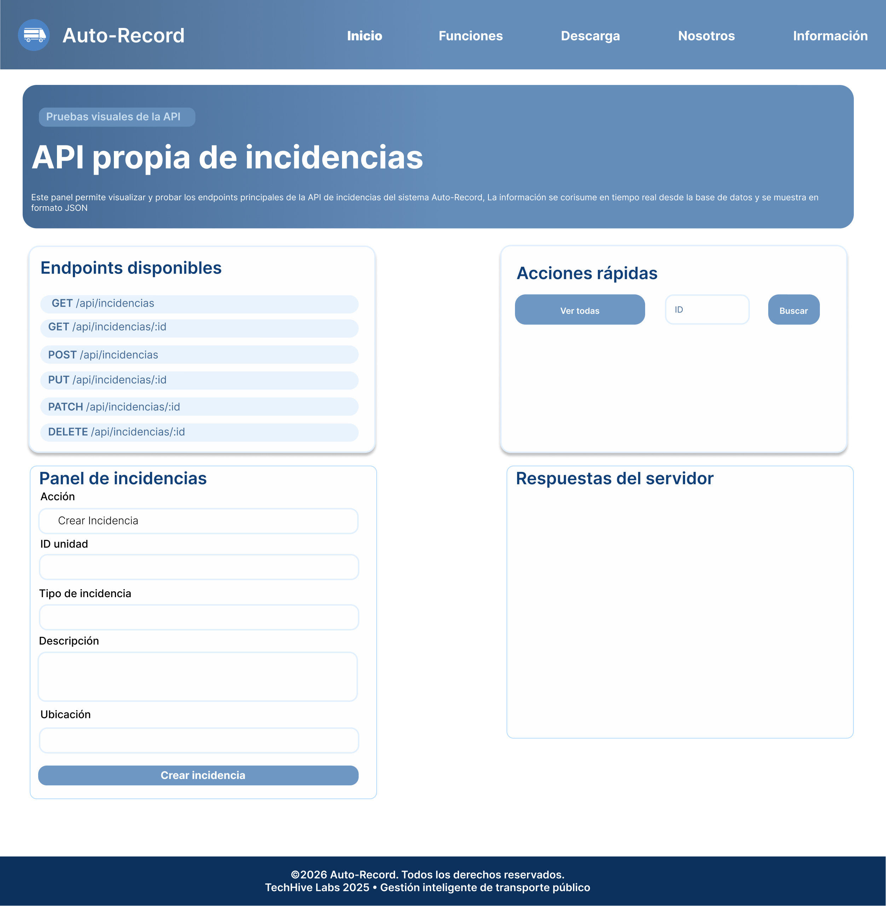

# UI/UX - Auto-Record

## Descripción general

La interfaz de usuario de **Auto-Record** fue diseñada con el objetivo de ofrecer una experiencia clara, moderna y funcional para la gestión operativa del transporte público. El sistema está orientado a facilitar el trabajo de los usuarios que participan en la supervisión y operación diaria de rutas, unidades y registros.

La propuesta visual busca transmitir organización, control, confianza y facilidad de uso, utilizando una estructura limpia basada en tarjetas, colores sobrios y elementos bien distribuidos.

---

## Objetivo del diseño UI/UX

El diseño UI/UX del sistema tiene como propósito principal mejorar la interacción entre el usuario y la plataforma, permitiendo que las acciones más importantes se realicen de manera rápida, intuitiva y ordenada.

Se buscó que cada pantalla tuviera una jerarquía visual clara, de modo que el usuario pudiera identificar fácilmente:
- información importante
- acciones principales
- formularios de registro
- reportes y consultas
- navegación entre módulos

---

## Enfoque de diseño

La propuesta visual de Auto-Record se desarrolló bajo los siguientes principios:

- **Claridad visual:** Se evitaron pantallas saturadas y se organizó la información en bloques bien definidos.
- **Consistencia:** Se mantuvo una línea gráfica uniforme en colores, tipografías, botones, formularios y tarjetas.
- **Accesibilidad operativa:** Se priorizó que choferes y checadores pudieran utilizar el sistema sin complicaciones.
- **Jerarquía de información:** Los títulos, subtítulos, estadísticas y botones principales se colocaron de forma estratégica para mejorar la lectura.
- **Enfoque práctico:** Las interfaces se diseñaron con base en necesidades reales del entorno de transporte público.

---

## Identidad visual

La identidad gráfica de Auto-Record se construyó utilizando una paleta basada en **tonos azules**, con el fin de transmitir:

- profesionalismo
- seguridad
- confianza
- organización

Además, se integraron tarjetas con bordes redondeados, fondos claros, sombras suaves y una distribución limpia de los componentes para reforzar la estética moderna de la aplicación.

---

## Estructura de navegación

La aplicación cuenta con una navegación principal accesible desde distintas vistas, la cual incluye secciones como:

- Inicio
- Funciones
- Descargas
- Nosotros
- Información

Esto permite que la plataforma no solo funcione como sistema operativo interno, sino también como una página informativa donde se explica la propuesta del proyecto.

---

## Pantallas diseñadas

### 1. Landing page / Inicio

La pantalla de inicio funciona como una vista informativa principal del proyecto. En ella se presenta una introducción al sistema, sus beneficios y un acceso rápido para usuarios con rol operativo.

Esta vista fue diseñada para:
- presentar la propuesta de valor del sistema
- mostrar beneficios generales
- ofrecer navegación clara
- brindar acceso a módulos internos

### 2. Pantalla de inicio de sesión

La pantalla de login permite a los usuarios acceder según su rol dentro del sistema. Se integraron opciones de autenticación tradicionales y sociales para mejorar la accesibilidad.

Su diseño se enfocó en:
- simplicidad
- facilidad de acceso
- claridad en el proceso de autenticación

### 3. Panel del checador

El panel del checador fue diseñado para centralizar acciones de supervisión y control operativo. Incluye indicadores visuales, formularios de registro y tablas de consulta.

Elementos destacados:
- estadísticas de unidades
- registro de vueltas
- estado de choferes
- acceso a reportes

### 4. Panel del chofer

El panel del chofer se diseñó para mostrar información relacionada con la ruta asignada, historial operativo e incidencias.

Elementos destacados:
- datos de ruta
- horarios
- historial de vueltas
- mapa de ubicación
- formulario de reporte de incidencias

### 5. Pantalla de reportes

La vista de reportes fue diseñada para facilitar el análisis de información registrada en el sistema. Se incluyeron filtros, tablas y una estructura clara para consultar incidencias y vueltas.

### 6. Panel visual de API

Como parte complementaria del proyecto, se desarrolló una interfaz visual para probar la API propia del sistema. Esta pantalla permite interactuar con endpoints relacionados con incidencias de manera más amigable y comprensible.

---

## Experiencia de usuario

El diseño UX del sistema considera que los usuarios necesitan acceder rápidamente a la información y ejecutar acciones sin procesos complejos. Por ello, se procuró que la experiencia general fuera:

- intuitiva
- ordenada
- rápida
- comprensible
- funcional

Se trabajó para que las acciones críticas del sistema, como registrar una incidencia o consultar reportes, fueran accesibles desde módulos específicos y con formularios sencillos.

---

### Wireframes

Los wireframes fueron utilizados como una representación inicial de las pantallas del sistema, enfocándose principalmente en:

- distribución de elementos (layout)
- jerarquía de información
- ubicación de botones y formularios
- organización de módulos (paneles, tablas, mapas, etc.)

En esta etapa no se consideraron colores ni estilos finales, ya que el propósito principal fue definir la estructura funcional de cada vista.

Se diseñaron wireframes para:
- landing page
- login
- panel del chofer
- panel del checador
- pantalla de reportes
- vista de API

Esto permitió detectar mejoras en la navegación y evitar errores antes de pasar al diseño visual.

---

### Prototipo en Figma

Posteriormente, se desarrolló un **prototipo de alta fidelidad en Figma**, en el cual se definieron los elementos visuales finales del sistema.

El prototipo incluye:

- paleta de colores (tonos azules profesionales)
- tipografía y estilos de texto
- componentes reutilizables (botones, inputs, cards)
- iconografía
- diseño responsivo
- estados de interacción (hover, activos, etc.)

Además, se creó un flujo interactivo que permite simular la navegación entre pantallas, facilitando la validación del diseño antes de su desarrollo en código.

---

### Importancia dentro del proyecto

El uso de wireframes y prototipos permitió:

- mejorar la organización del sistema desde etapas tempranas
- visualizar el funcionamiento antes de programar
- reducir errores en el desarrollo
- mantener consistencia en toda la interfaz
- facilitar la toma de decisiones de diseño

---

## Beneficios del diseño implementado

El diseño UI/UX de Auto-Record aporta beneficios importantes al sistema, entre ellos:

- mejora la organización visual de la información
- facilita la supervisión de datos operativos
- reduce errores al capturar información
- mejora la experiencia del usuario
- permite una navegación más fluida entre módulos
- fortalece la imagen profesional del proyecto

---

## Herramientas utilizadas

Para la construcción de la propuesta visual se utilizaron herramientas y tecnologías orientadas al desarrollo web, entre ellas:

- HTML
- CSS
- JavaScript
- EJS
- Tailwind CSS
- Figma
- Node.js
- Express

---

## Conclusión

El apartado de UI/UX de Auto-Record fue desarrollado para responder a necesidades reales del entorno de transporte público, priorizando la claridad, la funcionalidad y la facilidad de uso.

La propuesta visual no solo mejora la apariencia del sistema, sino que también apoya directamente la operación de los usuarios, permitiendo que el sistema sea más útil, accesible y profesional.